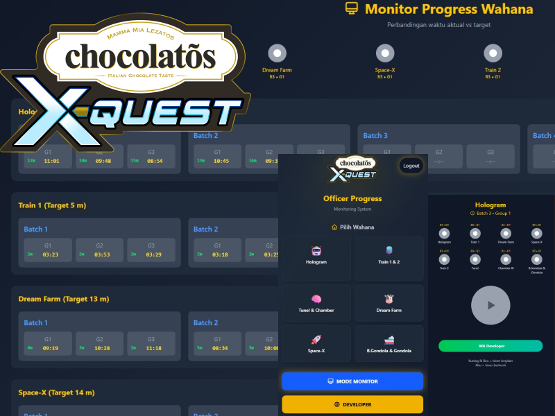

# 🚦 Officer Progress



Aplikasi web **Officer Progress** adalah sistem monitoring dan kontrol operasional wahana berbasis **React + Firebase Realtime Database** yang dirancang untuk kebutuhan operator (officer), monitor, dan developer.

Aplikasi ini digunakan untuk:

* Mengontrol alur **batch & group** setiap wahana
* Menghitung **durasi aktual** operasional secara realtime
* Menyimpan **log waktu otomatis**
* Menyediakan **monitoring global** dan **mode developer**

---

## ✨ Fitur Utama

### 🔐 Authentication

* Login menggunakan **Firebase Authentication**
* Proteksi halaman dengan **Protected Route**

### 🎮 Officer Mode

* Kontrol wahana secara realtime
* Tombol **Start / Lanjut / Stop**
* Timer otomatis per group
* Pergantian **batch & group** otomatis

### 🚆 Multi-Wahana Mode

* **Train Mode** → Train 1 & Train 2
* **Tunel Mode** → Tunel & Chamber AI
* Kontrol paralel dalam satu halaman

### 📊 Monitor Mode

* Monitoring status seluruh wahana
* Rekap durasi per wahana, batch, dan group
* Perbandingan dengan **target waktu**
* Export data ke **CSV**

### 🛠 Developer Mode

* Set batch & group manual
* Reset posisi wahana
* Edit durasi log
* maintenance & debugging

---

## 🧱 Teknologi

* **React (Vite)**
* **React Router DOM**
* **Firebase Authentication**
* **Firebase Realtime Database**
* **Tailwind CSS**
* **Framer Motion (UI animation)**

---

## 📂 Struktur Proyek

```
src/
├─ components/       # Reusable UI & Icons
├─ pages/
│  ├─ Home.jsx
│  ├─ Login.jsx
│  ├─ Officer.jsx
│  ├─ Train.jsx
│  ├─ Tunel.jsx
│  ├─ Monitor.jsx
│  └─ Developer.jsx
├─ firebase.js       # Firebase config
├─ App.jsx           # Routing & Protected Route
└─ main.jsx
```

---

## 🧭 Routing

| Path             | Deskripsi               |
| ---------------- | ----------------------- |
| `/login`         | Halaman login           |
| `/`              | Home / Dashboard        |
| `/officer/:id`   | Kontrol wahana tunggal  |
| `/officer/train` | Kontrol Train 1 & 2     |
| `/officer/tunel` | Kontrol Tunel & Chamber |
| `/monitor`       | Monitoring & rekap      |
| `/developer`     | Mode developer          |

---

## 🗄 Struktur Database (Firebase)

### `wahana`

Digunakan untuk **state realtime**.

```
wahanaX:
  batch: number
  group: number
  step: 0 | 1 | 2
  startTime: timestamp | null
```

**Makna Step:**

* `0` → IDLE
* `1` → PROSES
* `2` → READY

---

### `logs`

Digunakan untuk **penyimpanan durasi final**.

```
logs/
  wahanaX/
    batchY/
      groupZ/
        duration:
          minutes: number
          seconds: number
```

---

## 🔄 Alur Kerja Officer

1. **Start**

   * step → 1
   * startTime disimpan

2. **Lanjut**

   * step → 2
   * timer tetap berjalan

3. **Stop**

   * Durasi dihitung
   * Data disimpan ke `logs`
   * Group bertambah
   * Batch naik otomatis jika group selesai

---

## 📈 Target Waktu

Setiap wahana memiliki target durasi.

* 🟢 Hijau → lebih cepat dari target
* 🔴 Merah → lebih lama dari target

Digunakan pada halaman **Monitor**.

---

## ⚙️ Setup & Instalasi

### 1. Clone Repository

```
git clone <repository-url>
cd officer-progress
```

### 2. Install Dependency

```
npm install
```

### 3. Konfigurasi Firebase

Buat file `src/firebase.js`:

```
import { initializeApp } from "firebase/app";
import { getAuth } from "firebase/auth";
import { getDatabase } from "firebase/database";

const firebaseConfig = {
  apiKey: "YOUR_API_KEY",
  authDomain: "YOUR_DOMAIN",
  databaseURL: "YOUR_DB_URL",
  projectId: "YOUR_PROJECT_ID",
};

const app = initializeApp(firebaseConfig);

export const auth = getAuth(app);
export const db = getDatabase(app);
```

### 4. Jalankan Aplikasi

```
npm run dev
```

---

## 🧪 Akun Login

Gunakan akun yang sudah terdaftar di Firebase Authentication.

Role:

* **Officer** → Operasional
* **Monitor** → Monitoring
* **Developer** → maintenance

(Role diatur secara logika aplikasi)

---

## 📌 Catatan

* Mode Developer **hanya untuk admin**
* Jangan reset database saat operasional berlangsung
* Pastikan koneksi internet stabil untuk realtime update

---

## 📄 Lisensi

Internal Project — Tidak untuk distribusi publik.

---

✨ README ini dibuat sebagai panduan penggunaan dan pengembangan sistem **Officer Progress**.
